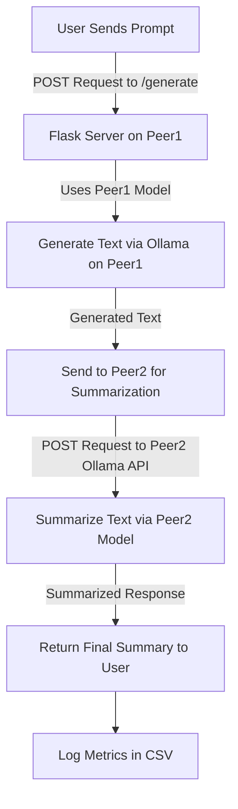

# LLM Peer-to-Peer Testing Framework

This repository contains a Flask-based implementation for testing the interaction and performance of multiple LLMs hosted across two peers in the same local network. The system is designed to generate responses and perform summarization using different LLM configurations. The Raspberry Pi 4B acts as `Peer1`, while a laptop serves as `Peer2`. Both peers utilize Ollama as the LLM backend.

---

## Project Structure

- **Peer1 (Raspberry Pi 4B):**
  - Runs the Flask application.
  - Hosts Ollama with models like `qwen2.5:0.5b-instruct` and `smollm2:360m-instruct-q8_0`.
  - Acts as the primary text generator.

- **Peer2 (Laptop):**
  - Hosts Ollama with larger models like `granite3.1-moe:1b` and `smollm2:1.7b`.
  - Summarizes text generated by Peer1.

- **Web Server Implementations:**
  - Flask-based API hosted on Peer1 for testing text generation and summarization workflows.
  - Equivalent implementation available for FastAPI.

---

## Workflow



### Workflow Steps:
1. **User Input:** A user sends a prompt to the `/generate` endpoint of the Flask server running on Peer1.
2. **Peer1 Text Generation:** Peer1 uses its default or specified model to generate text via Ollama.
3. **Send to Peer2:** The generated text is forwarded to Peer2 for summarization.
4. **Peer2 Summarization:** Peer2 uses its default model to summarize the received text.
5. **Response to User:** The summarized text, along with raw outputs from both peers, is returned to the user.
6. **Metrics Logging:** All interaction details are logged in a CSV file for performance analysis.

---

## Prerequisites

### 1. **Ollama Configuration:**

#### On Ubuntu or Raspberry Pi:
1. Edit the Ollama service configuration:
   ```bash
   sudo mkdir -p /etc/systemd/system/ollama.service.d
   sudo nano /etc/systemd/system/ollama.service.d/override.conf
   ```
2. Add the following lines:
   ```
   [Service]
   Environment="OLLAMA_HOST=0.0.0.0"
   ```
3. Reload and restart the Ollama service:
   ```bash
   sudo systemctl daemon-reload
   sudo systemctl restart ollama
   ```

4. Verify connectivity from another machine:
   ```bash
   curl http://<PEER_IP>:11434/api/version
   ```

---

### 2. **Flask Application Setup:**

1. Install Python dependencies:
   ```bash
   pip install flask requests
   ```

2. Run the Flask server:
   ```bash
   python app.py
   ```

3. Test the endpoint with a sample prompt:
   ```bash
   curl -X POST http://<PEER1_IP>:5000/generate \
   -H "Content-Type: application/json" \
   -d '{"prompt": "Explain quantum mechanics."}'
   ```

---

## Metrics Logged

The system records the following metrics for both peers:
- **LLM Information:** Model name and generated response.
- **Performance Metrics:**
  - Total duration
  - Load duration
  - Prompt evaluation counts and durations
  - Tokens processed per second
- **Network Latency:** Time taken for requests between peers.

---

## Testing Matrix

| Peer1 Models               | Peer2 Models               |
|----------------------------|----------------------------|
| `qwen2.5:0.5b-instruct` | `granite3.1-moe:1b`        |
| `qwen2.5:0.5b-instruct` | `llama3.2:1b`           |
| `qwen2.5:0.5b-instruct`  | `qwen2.5:1.5b`        |
| `qwen2.5:0.5b-instruct` | `smollm2:1.7b`           |
| `smollm2:360m-instruct-q8_0` | `granite3.1-moe:1b`        |
| `smollm2:360m-instruct-q8_0` | `llama3.2:1b`           |
| `smollm2:360m-instruct-q8_0`  | `qwen2.5:1.5b`        |
| `smollm2:360m-instruct-q8_0` | `smollm2:1.7b`           |


Each pair is tested under both Flask and FastAPI configurations.

---

## Future Enhancements

- Extend functionality to support additional peers.
- Introduce advanced routing mechanisms for load balancing.
- Implement real-time visualization of performance metrics.
```
